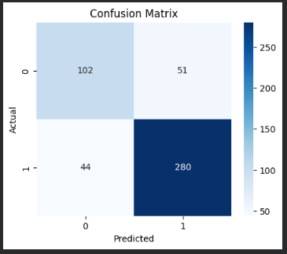
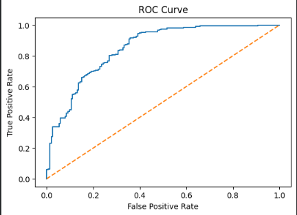
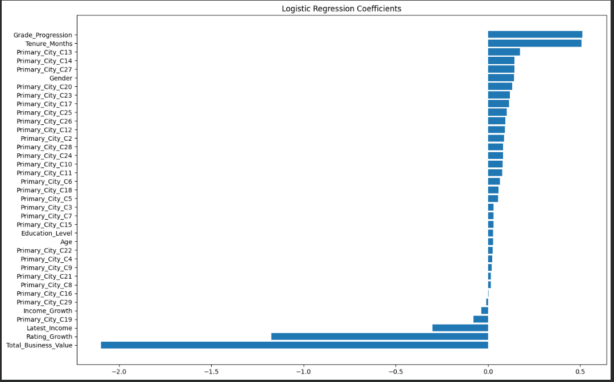

# Ola Driver Churn Analysis & Prediction

## Project Overview

This project focuses on analysing driver attrition at Ola and building a predictive model to identify drivers who are at risk of leaving the platform. The analysis combines exploratory data analysis, feature engineering, statistical validation, and machine learning to uncover the key factors influencing driver churn and provide actionable business recommendations.

---

## Business Problem

Driver retention is a major challenge for Ola. High driver attrition increases recruitment and onboarding costs while impacting operational efficiency and service availability. Since retaining existing drivers is more cost-effective than acquiring new ones, understanding the factors contributing to churn is essential.

The objective of this project is to:

* Identify the key factors associated with driver attrition.
* Analyse driver behaviour and performance trends.
* Develop a predictive model capable of identifying drivers at risk of churn.
* Generate actionable business recommendations to improve driver retention.

---

## Dataset Overview

The dataset contains monthly driver information collected during 2019 and 2020.

### Raw Dataset

* Records: 19,104 monthly observations
* Drivers: 2,381 unique drivers
* Time Period: 2019-2020

### Key Attributes

* Driver Demographics (Age, Gender, Education Level)
* Performance Metrics (Quarterly Rating, Grade)
* Compensation Metrics (Income)
* Business Metrics (Total Business Value)
* Location Information (City)

Since the prediction objective was at the driver level, the monthly dataset was aggregated into a single consolidated record per driver during feature engineering.

---

## Approach

### 1. Data Understanding & Cleaning

* Data exploration and structure validation
* Missing value analysis
* Statistical summary generation
* Date handling and validation

### 2. Exploratory Data Analysis

* Univariate analysis
* Bivariate analysis
* Target variable analysis
* Temporal trend analysis
* City-level analysis

### 3. Feature Engineering

* Driver-level aggregation
* Churn target creation
* Driver tenure calculation
* Growth-based feature creation
* Primary city identification

### 4. Feature Validation

* Relationship analysis
* Correlation analysis
* Multicollinearity assessment using VIF

### 5. Predictive Modelling

* Logistic Regression (Baseline Model)
* Class imbalance handling using class weights
* SMOTE-based model comparison
* Model evaluation and interpretation

---

## Feature Engineering

The following features were engineered to improve predictive performance and better capture driver behaviour:

| Feature           | Description                                                   |
| ----------------- | ------------------------------------------------------------- |
| churn_flag        | Target variable indicating whether a driver left the platform |
| Tenure_Months     | Duration of driver association with Ola                       |
| Income_Growth     | Change in income over time                                    |
| Rating_Growth     | Change in quarterly rating over time                          |
| Grade_Progression | Growth in driver grade over time                              |
| Primary_City      | Most frequently associated city for each driver               |

These features were designed to capture driver engagement, performance progression, and business contribution.

---

## Model Performance

### Final Model

**Logistic Regression (Class-Weighted Baseline)**

| Metric            | Score |
| ----------------- | ----- |
| Recall (Churn)    | 86%   |
| Precision (Churn) | 85%   |
| F1-Score (Churn)  | 85%   |
| ROC-AUC           | 0.851 |
| Accuracy          | 80%   |

### Confusion Matrix

### ROC Curve

A SMOTE-based model was also evaluated; however, the baseline Logistic Regression model delivered superior overall performance and was therefore selected as the final solution.

---

## Key Findings

* Total Business Value emerged as the strongest retention-related factor.
* Drivers whose ratings improved over time were significantly less likely to churn.
* Higher-income drivers demonstrated better retention behaviour.
* Churn rates peaked among drivers with approximately 7-16 months of tenure before declining among long-tenured drivers.
* Quarterly Rating showed a strong positive relationship with Total Business Value.
* Operational and performance-related factors exhibited stronger relationships with churn than demographic characteristics.

### Feature Importance

---

## Business Recommendations

### 1. Improve Driver Earnings

Drivers with higher earnings were less likely to churn. Strengthening earning opportunities through incentives and transparent compensation policies may improve retention.

### 2. Reward High-Performing Drivers

Drivers whose ratings improved over time showed lower churn rates. Performance recognition and reward programs can help retain high-performing drivers.

### 3. Support Low Business-Value Drivers

Drivers generating lower business value exhibited higher churn risk. Early identification and targeted support may reduce attrition.

### 4. Focus on Mid-Tenure Drivers

Churn was highest among drivers with approximately 7-16 months of tenure. Targeted engagement initiatives during this period may help improve retention.

---

## Tools Used

* Python
* Pandas
* NumPy
* Matplotlib
* Seaborn
* Scikit-learn
* Imbalanced-learn (SMOTE)
* Statsmodels

---

## Author

**Freddy Phil Stanly Eugin**

Aspiring Data Analyst | Python | SQL | Machine Learning | Data Visualization
